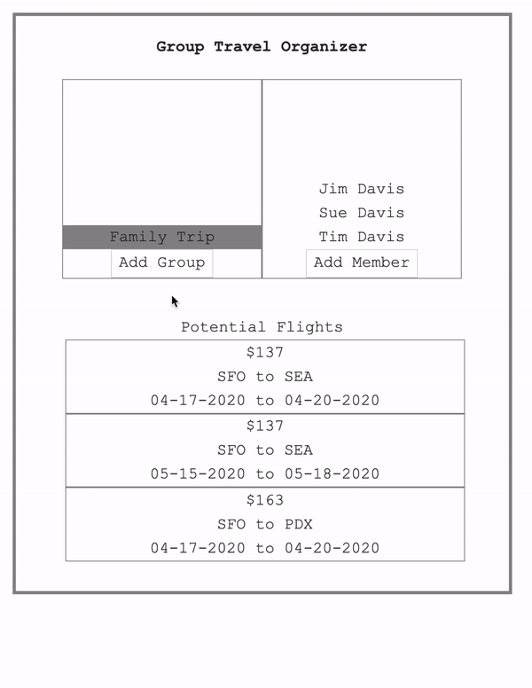

# flight-groups

I was inspired to make this app after being the travel coordinator for several trips with friends and family. The app allows you to define a travel group, then allows users to sign up with their availability for that trip (which destinations they would like to go to, and what days they are free on). The app then queries flight data, and displays the cheapest routes that work for all members of a given group. You can then click on the flight you want to choose, and it will route you to skyscanners website to book the flight. 

## Demo

